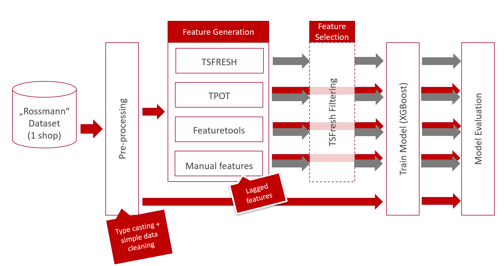

## Automating feature engineering

### About

Testing and benchmarking methods for automated feature engineering.
Currently the following python libraries are tested:

* [TPOT](https://epistasislab.github.io/tpot/)
* [featuretools](https://docs.featuretools.com/)
* [TSFRESH](https://tsfresh.readthedocs.io/en/latest/)

The provided python code, contained in the ``scripts/`` directory is based on the design of experiment shown in Figure 1. Beginning with a simple data preprocessing (``01_data_prep.py``) the dataset is prepared for all libraries. The resulting parquet files are saved to the ``data/processed/`` directory. The second step is for visuzalizing the underlying dataset (``02_visualization.py``). This step is followed by the automated generation of features by the libraries TPOT (``03_features_tpot.py``), featuretools (``03_features_featuretools.py``) and TSFRESH (``03_features_tsfresh.py``). Additionally manual features, which consists mainly out of lagged values, are generated (``03_features_manual.py``). These resulting feature dataframes are subsequently partitioned in a train- and testset (``04_partition_data.py``). Before TSFRESH's built in feature selection is applied on the genereated feature dataframes (``06_feature_selection.py``), some further experiments are optionally added in step five (``05_experiments.py``). Currently the base features of the original dataset are added  to the generated features at this point in order to be able to assess the quality of the latter ones. For each dataset generated in this way a XG-Boost model is trained (``07_compare_features.py``) and evaluated with respect to the feature-importance and performance (``08_model_analyisis.py``). 

All libraries are tested by using their recommended default settings. If you wish to adjust these you can do this for each library in the corresponding configuration file in the ``feature_engineering/`` directory. Furthermore, you are able to adjust the general experiment parameters.

Figure 1: *Design of Experiment*

### Dataset

For this analysis the dataset from the Rossmann Kaggle Challange was chosen (https://www.kaggle.com/c/rossmann-store-sales/data). Due to copyright protection the dataset is not included in this repository. Please download the dataset yourself and place the files in the ``data/input/`` directory. For the current implementation only the **store.csv** and the **train.csv** files are mandatory.
In order to speed up the necessary computation for model to be created, only the first store out of this store dataset is considered (Id = 1).

**Features:**

The following features are provided by the Rossmann-Dataset and in the evaluation context will be denoted as **base-features**.

- **Id** - an Id that represents a (Store, Date) duple within the test set
- **Store** - a unique Id for each store
- **Sales** - the turnover for any given day (this is what you are predicting)
- **Customers** - the number of customers on a given day
- **Open** - an indicator for whether the store was open: 0 = closed, 1 = open
- **StateHoliday** - indicates a state holiday. Normally all stores, with few exceptions, are closed on state holidays. Note that all schools are closed on public holidays and weekends. a = public holiday, b = Easter holiday, c = Christmas, 0 = None
- **SchoolHoliday** - indicates if the (Store, Date) was affected by the closure of public schools
- **StoreType** - differentiates between 4 different store models: a, b, c, d
- **Assortment** - describes an assortment level: a = basic, b = extra, c = extended
- **CompetitionDistance** - distance in meters to the nearest competitor store
- **CompetitionOpenSince[Month/Year]** - gives the approximate year and month of the time the nearest competitor was opened
- **Promo** - indicates whether a store is running a promo on that day
- **Promo2** - Promo2 is a continuing and consecutive promotion for some stores: 0 = store is not participating, 1 = store is participating
- **Promo2Since[Year/Week]** - describes the year and calendar week when the store started participating in Promo2
- **PromoInterval** - describes the consecutive intervals Promo2 is started, naming the months the promotion is started anew. E.g. "Feb,May,Aug,Nov" means each round starts in February, May, August, November of any given year for that store

### Contribute

If you have an idea on how to improve the current implementation or know of another library that has not yet been considered, please feel free to open a new pull request or contact us.

### Authors

- Dr. Thorben Jensen (tjensen@informationsfabrik.de)
- Jonas Jostmann (jjostmann@informationsfabrik.de)